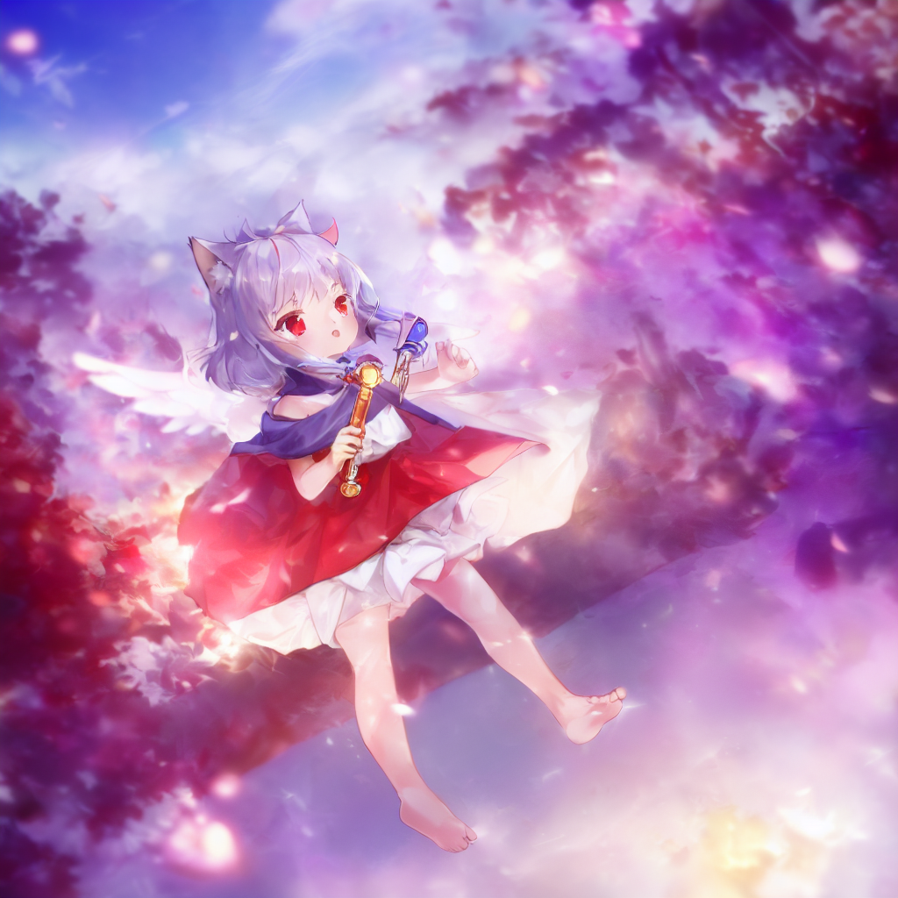

# stable-diffusion-webui-hires-fix-progressive

    A progressive upscaling-img2img version of hires.fix, extension script for AUTOMATIC1111/stable-diffusion-webui.

----

Highres.fix pipline gives us an inspirable way to sketch-and-refine an image, we could make it even further~


### Examples

⚪ progressive vs. official

| official |  |  |  |  |  |  |
| :-: | :-: | :-: | :-: | :-: | :-: | :-: |
| hires steps | 10 | 20 | 30 | 60 | 90 | 120 |
| **progressive** |  |  |  |  |  |  |
| iter \* step | 4\*3=12 | 4\*5=20 | 4\*8=32 | 4\*15=60 | 4\*23=92 | 4\*30=120 |

ℹ It is found that original hires.fix sometimes suffers from color red-shift, on the contratry, the progressive version suffers from blue-shift. I don't know why though...

⚪ balancing iter and step

| progressive |  |  |  |  |  |  |  |
| :-: | :-: | :-: | :-: | :-: | :-: | :-: | :-: |
| iter \* step = 120 | 1 \* 120 | 2 \* 60 | 3 \* 40 | 4 \* 30 | 6 \* 20 | 8 \* 15 | 10 \* 12 |

1x120:


2x60:


3x40:


4x30:


6x20:


8x15:


10x12:


| raw lowres (txt2img ouput) | raw highres (upscale only) |
| :-: | :-: |
|  |  |

Commom parameters for above demo images:

```text
Steps: 20
Sampler: Euler a
CFG scale: 7
Seed: 1919810                 
Size: 512 x 512
Target size: 1024 x 1024
Upscaler: Lanczos
Denoising strength: 0.5
```


### How it works

⚪ How the original hires.fix works?

It takes three steps:

- Several steps of `txt2img` to sketch a low resolution image
- One step `upscale` the low resolution image to a higher target resoultion
- Yet another several steps of `img2img` to refine the high resolution image

⚪ How a **progressive** hires.fix works?

Just make the upscale & img2img step repeatible and progressive:

- Several steps of txt2img to sketch a low resolution image
- Repeat the follwing steps until reaching the target resoultion
  - Upscale low resolution image to some higher itermediate resoultion
  - Small steps of img2img on the higher resolution image


### Options

- upscale_*
  - upscaler: (categorical), upscaleing method same as in hires.fix
  - resize_mode:
  - target_(width|height): (int), final image resolution
- img2img_*
  - iter: (int), the repeated upscale-img2img iteration
  - step: (int), img2img steps per iteration
  - denoise_strength: (float), denoise strength for img2img
  - prompt: (string), use another prompt for img2img, default to the main prompt box


### Installation

Easiest way to install it is to:
1. Go to the "Extensions" tab in the webui, switch to the "Install from URL" tab
2. Paste https://github.com/Kahsolt/stable-diffusion-webui-hires-fix-progressive.git into "URL for extension's git repository" and click install

Manual install:
1. Copy this repo folder to the 'extensions' folder of https://github.com/AUTOMATIC1111/stable-diffusion-webui

----

by Armit
2023/01/12 
